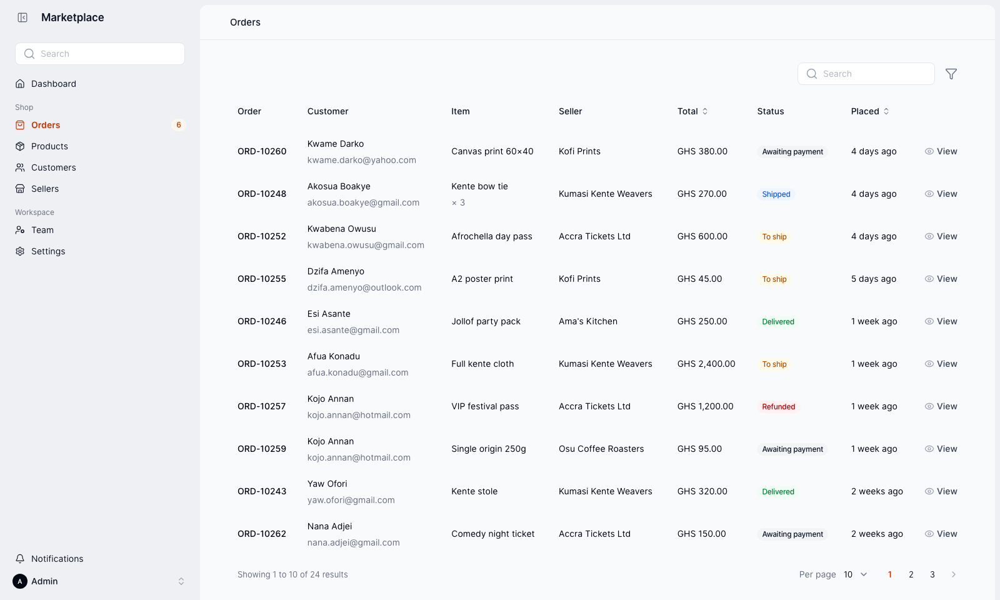
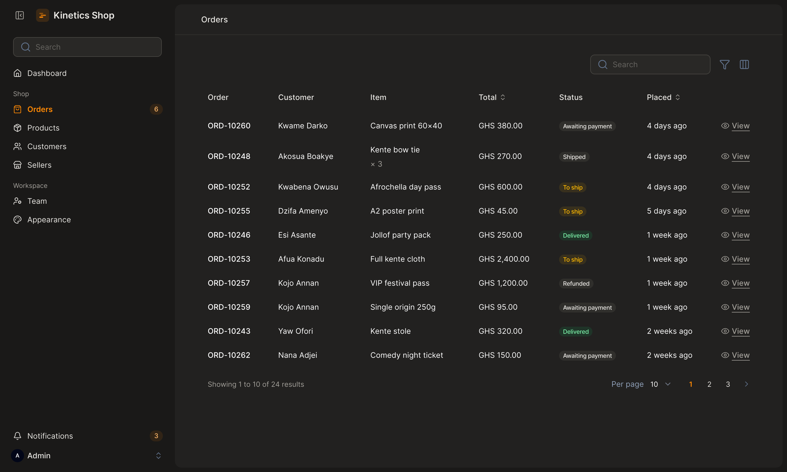

# Kinetics

[](https://packagist.org/packages/otatechie/filament-kinetics)
[](https://packagist.org/packages/otatechie/filament-kinetics/stats)
[](LICENSE.md)

A calm, compact theme for [Filament 5](https://filamentphp.com) admin panels.



Pages sit on a quiet canvas as one rounded panel. Tables have no lines,
controls are compact, and motion is quick and eased out. Kinetics takes its
colours from your panel and stays out of the way of your own Tailwind classes.

Kinetics is still being designed, so expect changes before 1.0. See
[Upgrading](docs/upgrading.md) when you update.

## What you get

- **A calmer layout.** No top bar: search, notifications and the account menu
  live in the sidebar, groups stay open, and the content sits on one rounded
  panel with no outlines.
- **Quiet tables.** No card, lines or background, compact rows, a soft rounded
  hover, and headings, cells and pagination on one edge. Wide tables show a
  soft shadow on the side that has more to scroll to.
- **Compact controls.** 40px inputs and buttons that line up, pill-shaped
  buttons, small checkboxes and switches, and links instead of buttons inside
  dropdowns.
- **Quick motion.** Everything under 300ms, eased out, and nothing moves when
  reduced motion is on.
- **A warm dark mode.** Charcoal with a hint of sepia, and off-white text.
- **Open Runde and Lucide.** A rounded, friendly font and a lighter icon set,
  bundled.
- **Better notifications.** Pop-ups in the bottom-right corner, clear of your
  buttons, and a plain, scannable notifications panel.
- **Your colours, accessible.** Every colour comes from the panel's palette, and
  buttons and links use the 700 shade so text passes contrast checks.
- **Setup checks.** A missing theme or wrong import order tells you what to fix.



## Compatibility

| Kinetics | Filament | Laravel | PHP |
|---|---|---|---|
| 0.x | 5.8.3 or later | 12, 13 | 8.3, 8.4, 8.5 |

Your panel also needs a
[custom theme](https://filamentphp.com/docs/5.x/styling/overview#creating-a-custom-theme)
built with Vite. `php artisan make:filament-theme` creates one.

## Quick start

```bash
composer require otatechie/filament-kinetics
php artisan make:filament-theme   # if your panel doesn't have a theme yet
```

In your theme's `theme.css`, import `layers.css` before Filament and
`kinetics.css` after it:

```css
@import '../../../../vendor/otatechie/filament-kinetics/resources/css/layers.css';
@import '../../../../vendor/filament/filament/resources/css/theme.css';
@import '../../../../vendor/otatechie/filament-kinetics/resources/css/kinetics.css';

@source '../../../../app/Filament/**/*';
@source '../../../../resources/views/filament/**/*';
```

Add the plugin to your panel, then build:

```php
use Otatechie\Kinetics\KineticsPlugin;

$panel
    ->plugin(KineticsPlugin::make())
    ->viteTheme('resources/css/filament/admin/theme.css');
```

```bash
npm run build
```

[Installation](docs/installation.md) covers each step in detail, including
multiple panels, updating and removing.

## Documentation

**Getting started**

- [Installation](docs/installation.md): requirements, setup, multiple panels,
  updating and removing
- [Troubleshooting](docs/troubleshooting.md): what each warning means, and
  fixes for common problems
- [Upgrading](docs/upgrading.md): what to change between versions

**Using Kinetics**

- [Customising](docs/customising.md): what the plugin sets, colours, font,
  layout, icons, notifications, every variable, dark mode, and styling your
  own pages
- [Components](docs/components.md): how each part of Filament is styled

**Background**

- [Design principles](docs/design-principles.md): the decisions behind the look
- [Motion](docs/motion.md): timing, easing and reduced motion
- [Accessibility](docs/accessibility.md): contrast, focus, keyboard use and
  notifications

**Contributing**

- [Development](docs/development.md): how the package is organised, the CSS
  rules, testing and releasing
- [Changelog](CHANGELOG.md)

## Credits

Motion follows [Emil Kowalski](https://emilkowal.ski/ui/7-practical-animation-tips).
Icons by [Lucide](https://lucide.dev). Open Runde by
[Laurids Kern](https://github.com/lauridskern/open-runde), under the SIL Open
Font License.

## License

MIT. See [LICENSE.md](LICENSE.md).
